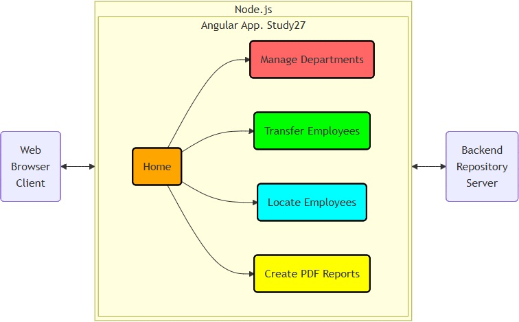

# Study27 README Contents

## Research on  [Angular](https://angular.dev/overview) with  [Material Design](https://material.angular.dev)

 ➔ [GitHub Pages](https://k1729p.github.io/)

 \
 Live Angular application demo ➔ [Study27 (GitHub Pages)](https://k1729p.github.io/Study27/)  \

Project sections:

1. [Business Logic](#-business-logic)
2. [Docker Build](#-docker-build)
3. [Local Build and Test](#-local-build-and-test)
4. [Cypress End-to-End Tests](#-cypress-end-to-end-tests)

[Back to the top of the page](#study27-readme-contents)

---

## ❶ Business Logic

 1.1. Links to diagrams.

- [Flowchart diagram](https://github.com/k1729p/Study27/blob/main/docs/mermaid/flowchartBusinessLogic.md)
  (with web page screenshots) for  business logic.
- [Sequence diagram](https://github.com/k1729p/Study27/blob/main/docs/mermaid/sequenceDiagram.md) for "Create Department" process.
- [Class diagram](https://github.com/k1729p/Study27/blob/main/docs/mermaid/classDiagram.md) for  models: Department, Employee, and Title.

 1.2. The backend repository.
Local web storage is used alone or together with a backend repository on an external Node.js Express server.

Available backend repositories:

- PostgreSQL database
- MongoDB database

 1.3. The TypeScript sources are located in the [app](https://github.com/k1729p/Study27/blob/main/src/app) directory.

Sources in the 'Home' section:

- [home](https://github.com/k1729p/Study27/blob/main/src/app/home) directory
- [home/home.component.ts](https://github.com/k1729p/Study27/blob/main/src/app/home/home.component.ts)

Sources in the 'Manage' section:

- [manage](https://github.com/k1729p/Study27/blob/main/src/app/manage) directory
- [manage/tables/department-table/department-table.component.ts](https://github.com/k1729p/Study27/blob/main/src/app/manage/tables/department-table/department-table.component.ts)
- [manage/tables/department-table/department-datasource.ts](https://github.com/k1729p/Study27/blob/main/src/app/manage/tables/department-table/department-datasource.ts)
- [manage/forms/department-form/department-form.component.ts](https://github.com/k1729p/Study27/blob/main/src/app/manage/forms/department-form/department-form.component.ts)
- [manage/tables/employee-table/employee-table.component.ts](https://github.com/k1729p/Study27/blob/main/src/app/manage/tables/employee-table/employee-table.component.ts)
- [manage/forms/employee-form/employee-form.component.ts](https://github.com/k1729p/Study27/blob/main/src/app/manage/forms/employee-form/employee-form.component.ts)

Sources in the 'Transfer' section:

- [transfer](https://github.com/k1729p/Study27/blob/main/src/app/transfer) directory
- [transfer/employee-transfer/employee-transfer.component.ts](https://github.com/k1729p/Study27/blob/main/src/app/transfer/employee-transfer/employee-transfer.component.ts)

Sources in the 'Locate' section:

- [locate](https://github.com/k1729p/Study27/blob/main/src/app/locate) directory
- [locate/employee-locate/employee-locate.component.ts](https://github.com/k1729p/Study27/blob/main/src/app/locate/employee-locate/employee-locate.component.ts)

Sources in the 'Report' section:

- [report](https://github.com/k1729p/Study27/blob/main/src/app/report) directory
- [report/report.component.ts](https://github.com/k1729p/Study27/blob/main/src/app/report/report.component.ts)

Sources in the 'Models' section:

- [models](https://github.com/k1729p/Study27/blob/main/src/app/models) directory
- [models/department.ts](https://github.com/k1729p/Study27/blob/main/src/app/models/department.ts)
- [models/employee.ts](https://github.com/k1729p/Study27/blob/main/src/app/models/employee.ts)
- [models/title.ts](https://github.com/k1729p/Study27/blob/main/src/app/models/title.ts)

Sources in the 'Services' section:

- [services](https://github.com/k1729p/Study27/blob/main/src/app/services) directory
- [services/department-service/department.service.ts](https://github.com/k1729p/Study27/blob/main/src/app/services/department-service/department.service.ts)
- [services/employee-service/employee.service.ts](https://github.com/k1729p/Study27/blob/main/src/app/services/employee-service/employee.service.ts)
- [services/initialization-service/initialization.service.ts](https://github.com/k1729p/Study27/blob/main/src/app/services/initialization-service/initialization.service.ts)
- [services/backend-endpoints.constants.ts](https://github.com/k1729p/Study27/blob/main/src/app/services/backend-endpoints.constants.ts)

 1.4. Reports are generated using 'pdfmake'. Example reports:

- [Departments and Employees Report](https://github.com/k1729p/Study27/blob/main/docs/pdf_reports/file.pdf)
- [Comprehensive Report](https://github.com/k1729p/Study27/blob/main/docs/pdf_reports/file-1.pdf)

[Back to the top of the page](#study27-readme-contents)

---

## ❷ Docker Build

Action: \
  \
  1. Use the batch file ["01 Angular on Docker build and run.bat"](https://github.com/k1729p/Study27/blob/main/0_batch/01%20Angular%20on%20Docker%20build%20and%20run.bat) 
to build the images and start the containers. \
  2. Use the web browser shortcut "11 Study27 on 8027.url"
for the 'Study27' application. \
 

 2.1. Docker images are built using the following files:

- [Dockerfile](https://github.com/k1729p/Study27/blob/main/docker-config/Dockerfile)
- [compose.yaml](https://github.com/k1729p/Study27/blob/main/docker-config/compose.yaml)

[Back to the top of the page](#study27-readme-contents)

---

## ❸ Local Build and Test

Action: \
  \
  1. Use the batch file ["02 Angular on local build and run.bat"](https://github.com/k1729p/Study27/blob/main/0_batch/02%20Angular%20on%20local%20build%20and%20run.bat)
to build and start the local application. \
  2. Use the batch file
["03 Angular lint and test.bat"](https://github.com/k1729p/Study27/blob/main/0_batch/03%20Angular%20lint%20and%20test.bat)
to lint and start the Karma tests. \
  3. Use the web browser shortcut "12 Study27 on 4200.url"
for the application on port 4200 started with 'ng serve'. \
 

 3.1. See the [screenshot](images/ScreenshotKarmaTests.jpg)
showing the results of the Karma tests.

[Back to the top of the page](#study27-readme-contents)

---

## ❹ Cypress End-to-End Tests

Action: \
  \
  Use the batch file
["04 Cypress tests.bat"](https://github.com/k1729p/Study27/blob/main/0_batch/04%20Cypress%20tests.bat)
to start the Cypress tests. \
 

 4.1. The test scripts are in the
[cypress/e2e](https://github.com/k1729p/Study27/blob/main/cypress/e2e) directory.

Some test screenshots generated by Cypress:

- [Read department and employee](https://html-preview.github.io/?url=https://github.com/k1729p/Study27/blob/main/docs/cypress_screenshots/11_read_department_and_employee.html) (using PostgreSQL repository)
- [Create department and employee](https://html-preview.github.io/?url=https://github.com/k1729p/Study27/blob/main/docs/cypress_screenshots/12_create_department_and_employee.html) (using PostgreSQL repository)
- [Update department and employee](https://html-preview.github.io/?url=https://github.com/k1729p/Study27/blob/main/docs/cypress_screenshots/13_update_department_and_employee.html) (using PostgreSQL repository)
- [Delete department and employee](https://html-preview.github.io/?url=https://github.com/k1729p/Study27/blob/main/docs/cypress_screenshots/14_delete_department_and_employee.html) (using PostgreSQL repository)
- [Transfer employees](https://html-preview.github.io/?url=https://github.com/k1729p/Study27/blob/main/docs/cypress_screenshots/21_transfer_employees.html) (using WebStorage repository)
- [Locate employee](https://html-preview.github.io/?url=https://github.com/k1729p/Study27/blob/main/docs/cypress_screenshots/31_locate_employee.html) (using MongoDB repository)
- [Open report](https://html-preview.github.io/?url=https://github.com/k1729p/Study27/blob/main/docs/cypress_screenshots/41_open_report.html) (using MongoDB repository)

[Back to the top of the page](#study27-readme-contents)

---

## Links

| Resource | Description |
| :--- | :--- |
| [Material Design 3](https://m3.material.io/) | However, this Angular Material project uses Material Design 2. |
| [Angular Material UI components](https://material.angular.io/components/categories) | UI components based on the Material Design specification. |
| [Angular Material CDK](https://material.angular.io/cdk/categories) | A set of behavioral primitives for building UI components. |
| [HTTP Client](https://angular.dev/guide/http) | The Angular HTTP Client service. |
| [pdfmake](https://pdfmake.github.io/docs/0.1/) | PDF document generation library. |
| [Google Icons](https://fonts.google.com/icons?icon.size=24&icon.color=%231f1f1f) | Icons used in the Material menu. |
| [Angular CLI](https://angular.dev/tools/cli) | The Angular CLI command-line interface tool. |
| [Cypress](https://www.cypress.io/) | The front-end testing tool. |
| [Karma](https://karma-runner.github.io/) | The test runner. |
| [GitHub Pages](https://docs.github.com/en/pages/) | Creates a website directly from a GitHub repository. |

---

## Acronyms

| Acronym | Meaning |
| :--- | :--- |
| ARIA | Accessible Rich Internet Applications |
| CDK | Component Dev Kit |
| CSR | Client-side Rendering |
| ESM | ECMAScript Module |
| PWA | Progressive Web Application |
| SPA | Single Page Application |
| SSG | Static Site Generation |
| SSR | Server-Side Rendering |

[Back to the top of the page](#study27-readme-contents)

---
