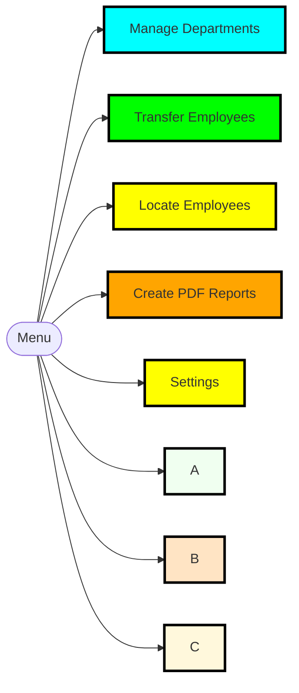

```mermaid
flowchart LR
  MENU([Menu])
  MNG[Manage Departments]:::cyanBox
  TRN[Transfer Employees]:::greenBox
  LOC[Locate Employees]:::yellowBox
  PDF[Create PDF Reports]:::orangeBox
  SET[Settings]:::yellowBox
  A[A]:::honeydewBox
  B[B]:::bisqueBox
  C[C]:::cornsilkBox
%% Flows
    MENU --> MNG
    MENU --> TRN
    MENU --> LOC
    MENU --> PDF
    MENU --> SET
    MENU --> A
    MENU --> B
    MENU --> C
%% Style Definitions
    classDef greenBox fill: #00ff00, stroke: #000, stroke-width: 3px
    classDef cyanBox fill: #00ffff, stroke: #000, stroke-width: 3px
    classDef yellowBox fill: #ffff00, stroke: #000, stroke-width: 3px
    classDef orangeBox  fill: #ffa500,stroke:#000,stroke-width:3px
    classDef honeydewBox  fill: honeydew,stroke:#000,stroke-width:3px
    classDef bisqueBox  fill: bisque,stroke:#000,stroke-width:3px
    classDef cornsilkBox  fill: cornsilk,stroke:#000,stroke-width:3px
```
