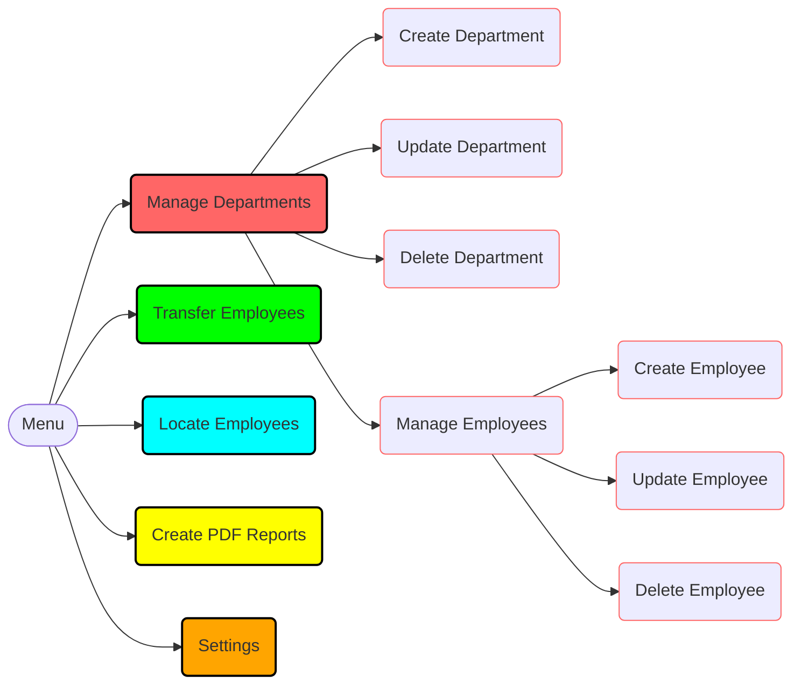

```mermaid
flowchart LR
  MENU([Menu])
  M_DEP(Manage Departments):::redBox
  M_DEP_CR(Create Department):::redStroke
  M_DEP_UP(Update Department):::redStroke
  M_DEP_DL(Delete Department):::redStroke
  M_EMP(Manage Employees):::redStroke
  M_EMP_CR(Create Employee):::redStroke
  M_EMP_UP(Update Employee):::redStroke
  M_EMP_DL(Delete Employee):::redStroke
  TRA_EMP(Transfer Employees):::greenBox
  LOC(Locate Employees):::cyanBox
  PDF(Create PDF Reports):::yellowBox
  SET(Settings):::orangeBox
%% Flows
  MENU --> M_DEP
  M_DEP --> M_DEP_CR
  M_DEP --> M_DEP_UP
  M_DEP --> M_DEP_DL
  M_DEP --> M_EMP
  M_EMP --> M_EMP_CR
  M_EMP --> M_EMP_UP
  M_EMP --> M_EMP_DL
  MENU --> TRA_EMP
  MENU --> LOC
  MENU --> PDF
  MENU --> SET
%% Links
  click M_DEP "https://github.com/k1729p/Study27/blob/main/docs/images/ScreenshotManageDepartments.jpg" _blank
  click M_DEP_CR "https://github.com/k1729p/Study27/blob/main/docs/images/ScreenshotCreateDepartment.jpg" _blank
  click M_DEP_UP "https://github.com/k1729p/Study27/blob/main/docs/images/ScreenshotUpdateDepartment.jpg" _blank
  click M_DEP_DL "https://github.com/k1729p/Study27/blob/main/docs/images/ScreenshotDeleteDepartment.jpg" _blank
  click M_EMP "https://github.com/k1729p/Study27/blob/main/docs/images/ScreenshotManageEmployees.jpg" _blank
  click M_EMP_CR "https://github.com/k1729p/Study27/blob/main/docs/images/ScreenshotCreateEmployee.jpg" _blank
  click M_EMP_UP "https://github.com/k1729p/Study27/blob/main/docs/images/ScreenshotUpdateEmployee.jpg" _blank
  click M_EMP_DL "https://github.com/k1729p/Study27/blob/main/docs/images/ScreenshotDeleteEmployee.jpg" _blank
  click TRA_EMP "https://github.com/k1729p/Study27/blob/main/docs/images/ScreenshotTransferEmployees.jpg" _blank
  click LOC_EMP "https://github.com/k1729p/Study27/blob/main/docs/images/ScreenshotLocateEmployees.jpg" _blank
  click PDF "https://github.com/k1729p/Study27/blob/main/docs/images/ScreenshotCreatePDFReports.jpg" _blank
%% Style Definitions
  classDef redBox fill: #ff6666, stroke: #000, stroke-width: 2px
  classDef redStroke stroke: #ff6666
  classDef greenBox fill: #00ff00, stroke: #000, stroke-width: 2px
  classDef cyanBox fill: #00ffff, stroke: #000, stroke-width: 2px
  classDef yellowBox fill: #ffff00, stroke: #000, stroke-width: 2px
  classDef orangeBox  fill: #ffa500,stroke:#000,stroke-width:2px
```
