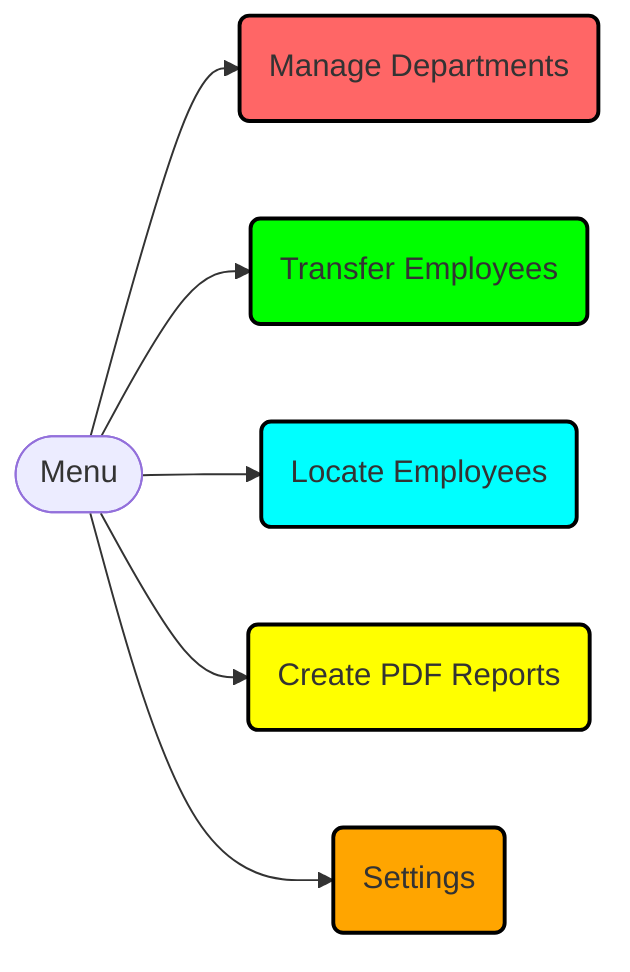

```mermaid
flowchart LR
  MENU([Menu])
  MNG(Manage Departments):::redBox
  TRN(Transfer Employees):::greenBox
  LOC(Locate Employees):::cyanBox
  PDF(Create PDF Reports):::yellowBox
  SET(Settings):::orangeBox
%% Flows
  MENU --> MNG
  MENU --> TRN
  MENU --> LOC
  MENU --> PDF
  MENU --> SET
%% Style Definitions
  classDef redBox fill: #ff6666, stroke: #000, stroke-width: 2px
  classDef greenBox fill: #00ff00, stroke: #000, stroke-width: 2px
  classDef cyanBox fill: #00ffff, stroke: #000, stroke-width: 2px
  classDef yellowBox fill: #ffff00, stroke: #000, stroke-width: 2px
  classDef orangeBox  fill: #ffa500,stroke:#000,stroke-width:2px
```
