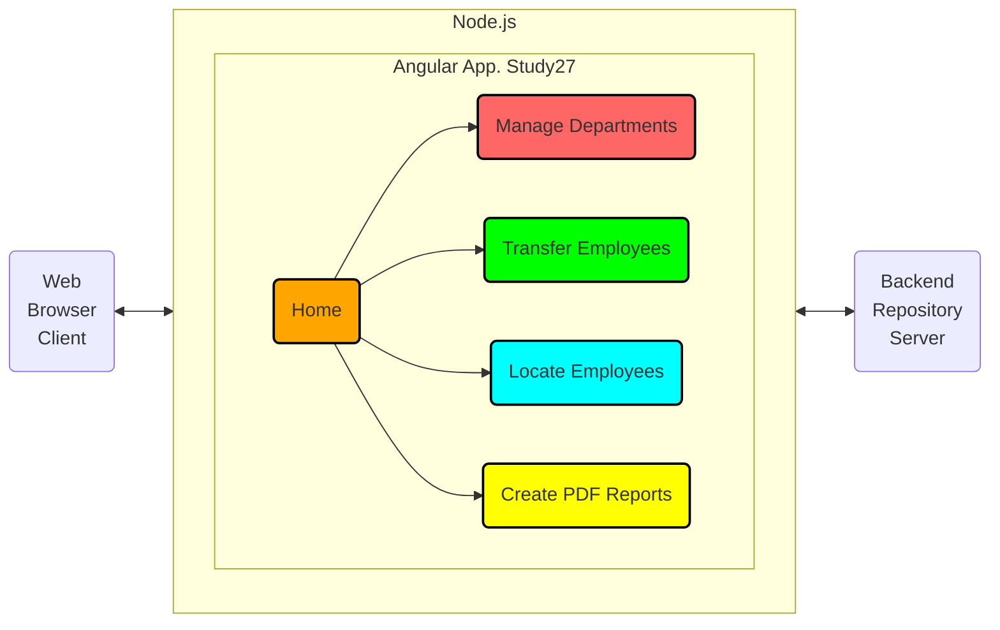

```mermaid
flowchart LR
  HOME(Home):::orangeBox
  M_DEP(Manage Departments):::redBox
  TRA_EMP(Transfer Employees):::greenBox
  LOC_EMP(Locate Employees):::cyanBox
  PDF(Create PDF Reports):::yellowBox
  WBC("Web<br>Browser<br>Client")
  BRS(Backend<br>Repository<br>Server)
%% Flows
  subgraph Node.js
    subgraph "Angular App. Study27"
      HOME --> M_DEP
      HOME --> TRA_EMP
      HOME --> LOC_EMP
      HOME --> PDF
    end
  end

  WBC <--> Node.js <--> BRS
%% Style Definitions
  classDef redBox fill: #ff6666, stroke: #000, stroke-width: 2px
  classDef greenBox fill: #00ff00, stroke: #000, stroke-width: 2px
  classDef cyanBox fill: #00ffff, stroke: #000, stroke-width: 2px
  classDef yellowBox fill: #ffff00, stroke: #000, stroke-width: 2px
  classDef orangeBox  fill: #ffa500,stroke: #000, stroke-width:2px
```