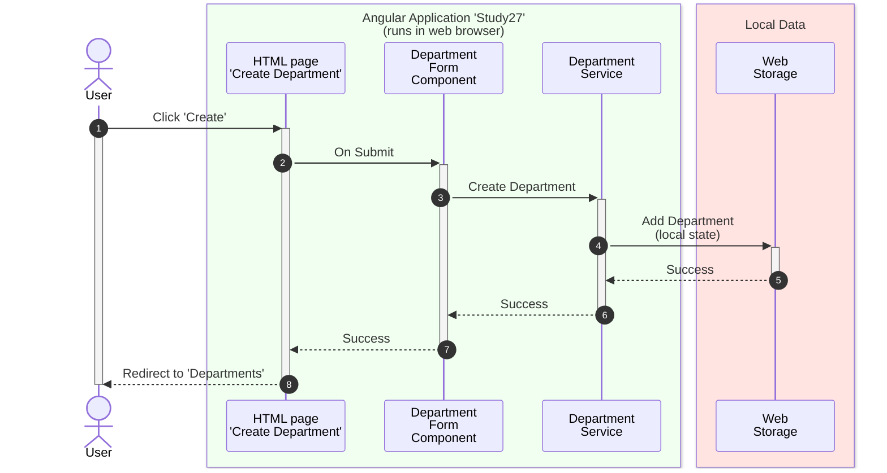
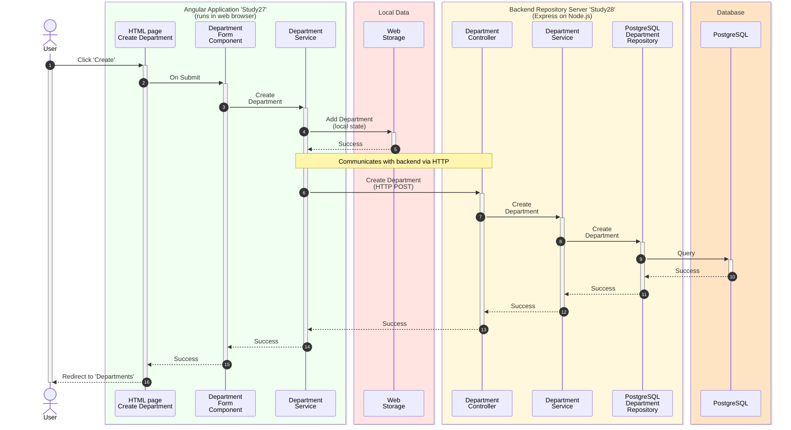

# Create Department Sequence Diagram

Angular application loaded from Node.js dev server and executed in browser.

## 1️⃣ Selected repository: only local web storage

## 2️⃣ Selected repository: PostgreSQL database

