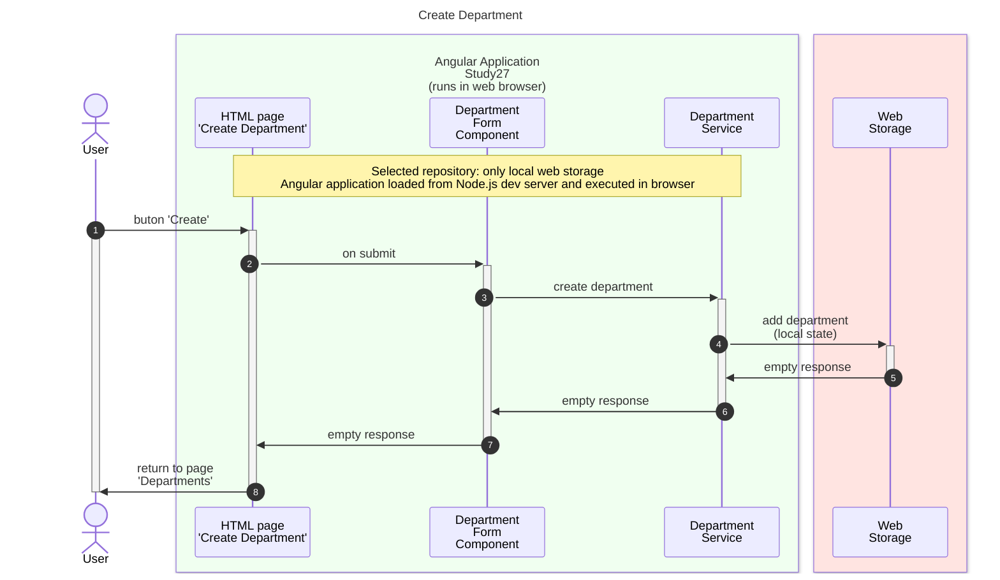
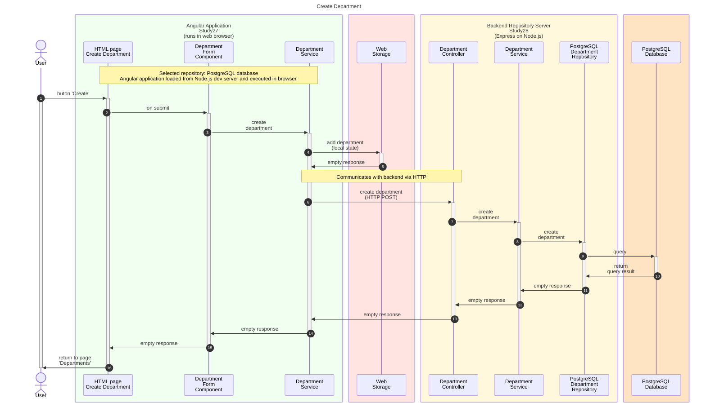

```mermaid
---
title: Create Department
#config:
#  theme: base
---
sequenceDiagram
    actor USR as User
    box honeydew <br>Angular Application<br>Study27<br>(runs in web browser)
        participant PAGE as HTML page<br>'Create Department'
        participant FRM as Department<br>Form<br>Component
        participant SRV as Department<br>Service
    end
    box mistyrose
        participant WST as Web<br>Storage
    end

    autonumber 1
    Note over PAGE, SRV: Selected repository: only local web storage<br>Angular application loaded from Node.js dev server and executed in browser
    USR ->>+ PAGE: buton 'Create'
    activate USR
    PAGE ->>+ FRM: on submit
    FRM ->>+ SRV: create department
    SRV ->>+ WST: add department<br>(local state)
    WST ->>- SRV: empty response
    SRV ->>- FRM: empty response
    FRM ->>- PAGE: empty response
    PAGE ->>- USR: return to page<br>'Departments'
    deactivate USR
```

```mermaid
---
title: Create Department
---
sequenceDiagram
    actor USR as User
    box honeydew <br>Angular Application<br>Study27<br>(runs in web browser)
        participant PAGE as HTML page<br>Create Department
        participant FRM as Department<br>Form<br>Component
        participant SRV as Department<br>Service
    end
    box mistyrose
        participant WST as Web<br>Storage
    end
    box cornsilk <br>Backend Repository Server<br>Study28<br>(Express on Node.js)
        participant DC as Department<br>Controller
        participant DS2 as Department<br>Service
        participant DR as PostgreSQL<br>Department<br>Repository
    end
    box bisque
        participant PSQL as PostgreSQL<br>Database
    end
    autonumber 1
    Note over PAGE, SRV: Selected repository: PostgreSQL database<br>Angular application loaded from Node.js dev server and executed in browser.
    USR ->>+ PAGE: buton 'Create'
    activate USR
    PAGE ->>+ FRM: on submit
    FRM ->>+ SRV: create<br>department
    SRV ->>+ WST: add department<br>(local state)
    WST ->>- SRV: empty response
    Note over SRV, DC: Communicates with backend via HTTP
    SRV ->>+ DC: create department<br>(HTTP POST)
    DC ->>+ DS2: create<br>department
    DS2 ->>+ DR: create<br>department
    DR ->>+ PSQL: query
    PSQL ->>- DR: return<br>query result
    DR ->>- DS2: empty response
    DS2 ->>- DC: empty response
    DC ->>- SRV: empty response
    SRV ->>- FRM: empty response
    FRM ->>- PAGE: empty response
    PAGE ->>- USR: return to page<br>'Departments'
    deactivate USR
```
